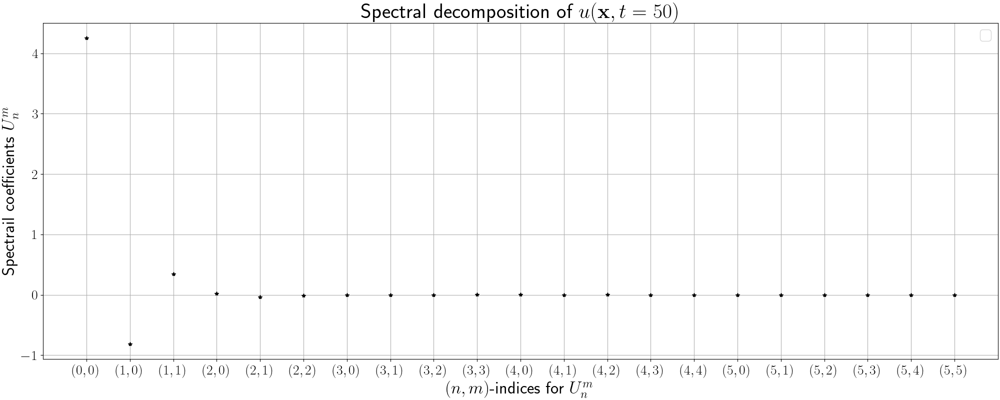
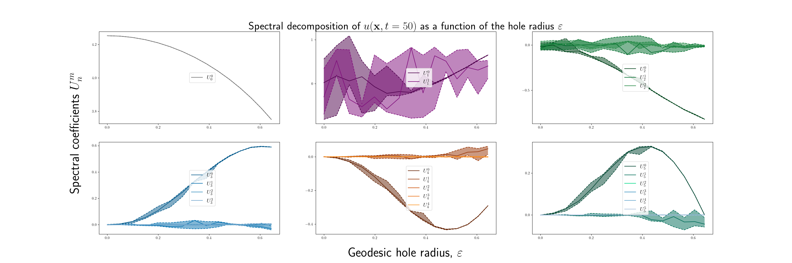

# Step by step guide
Here, we will go through every detail behind the various scripts step by step. In summary, there are four main steps here:

1. Theoretical prediction,
2. Generate meshes and convert their format,
3. Run FEM simulations on the meshes,
4. Analyse the data generated by the FEM simulations. 

In order to be able to conduct these steps, you must have installed the two conda environments "*fenicsproject*" and "*gmsh\_latest\_version*" (see the file with local path "../README.md"). Other than that, you must have installed Python as well as the two Python libraries *numpy* and *matplotlib*.  

# 1. Theoretical prediction
We will consider the following parameters of the Schnakenberg model: (a,b,gamma,d)=((0.20,1.00,20.00,6.87). These parameters isolate the eigenmode n=1. 

Interestingly, Bandle et al. [1] have derived a theoretical formula for how the perturbed eigenvalue of the Laplace-Beltrami operator is affected when a hole is added on the south pole. To plot the perturbed eigenvalues as a function of the radius of the hole, run the following script: 

*python find\_parameters\_and\_plot\_perturbed\_eigenvalues.py*

. Then, the figure below will be generated. 

What this figure tells us is there is always at least one eigenvalue corresponding to n=1 the intervall indicated by the dashed lines denoted by M and L. In turn, this leads to the following rather striking conclusion: *the patterns are unaffected by the introduction of a hole in the sphere*. 

Next, we wish to validate this theoretical prediction by running FEM simulations. In order to be able to run these simulations, we first need to generate some meshes of spheres which have a single hole of varying size located at the south pole.
 
# 2. Generate meshes and convert their format
If you look into the folder with path "../Meshes" you see that it is empty with the exception of the README.md file. To this end, we want to fill this folder with numerous meshes so that we can run FEM simulations on these meshes. Concretely, we want to do two things:

1. Generate meshes of numerous spheres with a single hole located at the south pole using Gmsh,
2. Convert the format of these meshes so that they can be read by FEniCS.

## 2.1 Generate meshes of numerous spheres with a single hole located at the south pole using Gmsh
Begin by activating the conda environment "*gmsh\_latest\_version*":

*conda activate gmsh\_latest\_version* 

or alternatively (if this does not work) 

*source activate gmsh\_latest\_version* 

. Next, let's look at an example of the type of mesh we want to generate by running the script 

*python visualise\_spherical\_mesh\_with\_hole.py* 

. If Gmsh works properly, a graphical interface will be opened. In this interface you can click on "*Tools->Options->Mesh*" and then check the box "*2D element faces*" and you will see what the mesh looks like. Sometimes there are some issues with the graphical interface of Gmsh, but this is not the end of the world as you can normally still generate the meshes. As you can see in this script, the meshes are generated by intersecting a cylinder of radius r with the unit sphere at the south pole (0,0,-1) and then we remove the intersection between these surfaces. 

Next, we would like to generate 15 meshes where the cylindrical radii of the single hole located at the south pole are given by r=0,0.05,0.10,...,0.70. This is achieved by running the script

*python generate\_spherical\_meshes\_with\_holes.py* 

. After this script has terminated, you can now see that we have 15 meshes in the folder "../Meshes/" which are stored in the format with suffix ".msh". To get an idea of what these meshes look like, see the figure below. 

We should say that all of the functions required to generate these meshes using Gmsh, are stored in the script 

"*toolbox\_generate\_meshes.py*"

. Now, we have generated the meshes using Gmsh, and next we need to convert these meshes into another format that can be read by FEniCS which we will use to run FEM simulations on these meshes. To this end, we exit the current conda environment by typing 

*conda deactivate* 

and next we will convert the format of these meshes.

## 2.2 Convert the format of these meshes so that they can be read by FEniCS
We proceed by activating the environment *fenicsproject*: 

*conda activate fenicsproject* 

and thereafter we run the following script 

*python convert\_meshes\_from\_msh\_to\_xdmf.py* 

. If you look in the folder "../Meshes" you see that new meshes with the formats ".h5" and ".xdmf" have been created. It is the xdmf-format that can be read by FEniCS which will allow us to run FEM-simulations on these meshes. Next, we exit the current conda environment 

*conda deactivate* 

before we can start running some FEM simulations. 

# 3. Run FEM simulations on the meshes
Next, we want to launch the full experimental design corresponding to the eigenmode n=1. Since, we have stochastic initial conditions we want to repeat each simulation on a specific mesh a specific number of times. In the article, we repeat each simulation 20 times on all of the 15 meshes for each eigenmode, and accordingly this means that our launch-script will launch 300 simulations in total. If you just go ahead and run these simulations, your computer will probably be occupied with these simulations for up to a week. This is of course a very long time, but luckily there is a way to speed up these calculations substantially. 

To speed up the FEM simulations, you can implement a clever choice of parallelisation. Here, I want to emphasise that there are really bad ways of parallelising the code, and one of these is the one that is automatically implemented in FEniCS. More specifically, FEniCS uses all cores on your computer to solve a single matrix equation in each time step of the finite difference time stepping procedure, and from a performance perspective it is really unneccessary to do this as each of these matrix system can be solved more efficiently *on a single core*. Therefore, we would like to force FEniCS to disable its automatic parallelisation before we run any simulations. 

On ubuntu, this is done by adding the following lines to your .bashrc-script:  

*\# Make sure FEniCS only uses one core at a time* 
*export OMP\_NUM\_THREADS=1* 

and after this, you need to shut down and re-open your terminal windows in order to make sure that FEniCS merely uses one core at a time. 

Now, you are able to run all of these 300 simulations much more efficiently. If you navigate to the folder "../Output" you see that this folder is empty currently, and as soon as you begin to run the simulations numerous subfolders will be created with data files corresponding to each simulation. For more information on the subfolders that are created in the folder "../Output", see the file "../Output/README.md". 

Anyhow, to run our 300 simulations, begin by activating the conda-environment *fenicsproject*: 

*conda activate fenicsproject* 

. Next, you will launch all simulations by executing the command  

*python launch\_simulations\_Schnakenberg\_sphere\_with\_holes.py* 

. As you will see in the folder "../Output/", numerous subfolders are now created which contain datafiles and in the next section we analyse this data. Also, this launch script is written so that it runs multiple repititions on each mesh *in parallel*, or more specifically, it runs *one simulation per core and multiple simulations in parallel on numerous cores*. This modification increases the performance substantially, and currently the script will occupy all of your cores except for one. In other words, on my computer which has 8 cores, it uses 7 of these to run 7 repititions out of 20 in parallel. In practice, this means that the computation time decreases from several days to around 8 hours. Therefore, it is highly recommended that you implement these parallelisation tricks before you launch all simulations. On ubuntu, you can use the command [*htop*](https://manpages.ubuntu.com/manpages/trusty/man1/htop.1.html) to check whether the parallelisation works or not. 

Moreover, we should say that all of the functions required for running the FEM-based simulations using FEniCS are stored in the script 

*toolbox\_FEM\_simulations\_Schnakenberg\_sphere\_with\_holes.py* 

. So, when you come back after, say, 8 hours, your folder with path "../Output/" will be full of data files. For example, to see what the concentration profile of the active component looks like at time t=50, you can open the pvd-files stored in the subfolders of the Output-folder in [*ParaView*](https://www.paraview.org/). If you study these pvd-files, you will see that the patterns (i.e. the number of poles, the size and shape of them etc.) are preserved when a hole is introduced into the mesh (see the figure below). 

Moreover, there are more data files in all of the subfolders of the folder with path "../Output/", and with them we can extract and analyse various quantitative properties of the patterns that were formed on the various meshes. Let's analyse this data and generate some nice plots! 

# 4. Analyse the data generated by the FEM simulations 
Given all of our data files, we wish to analyse them in two different ways:

1. The spectral properties of the FEM-solution,
2. The quantiative properties of the formed pattern in the concentration profile of the active component at time t=50.

## 4.1 The spectral properties of the FEM-solution
Firstly, we will analyse the spectral properties of the concentration profile of the active component at time t=50. More precisely, we would like to express the calculated FEM solutions corresponding to the concentration profile of the active component at time t=50 in terms of the basis functions of the Laplace-Bletrami operator. 

To this end, you will need to activate the conda environment called *fenicsproject*: 

*conda activate fenicsproject* 

and then you can run the script "*final\_concentration\_decomposition*": 

*python final\_concentration\_decomposition.py* 

. As you will see in the generated figure (see the figure below), for the chosen parameters it is only the eigenmodes corresponding to n=0 and n=1 that are excited in the concentration profile of the active component at time t=50. 

Next, we will repeat the same spectral analysis on all meshes with a single hole on the south pole with increasing radius. To this end, run the script called *plot\_perturbed\_eigenfunctions*: 

*python plot\_perturbed\_eigenfunctions.py*

. As you will see, a plot of the various coefficients in the spectral decomposition of the concentration profile of the active component at time t=50 as a function of the hole radius will be generated (see the figure below). 

Next, we will analyse the quantitative properties of the concentration profile of the active component at time t=50.

## 4.2 The quantitative properties of the formed pattern in the concentration profile of the active component at time t=50
We analyse four quantitative properties of the concentration profile of the active component at time t=50 as a function of the hole radius:

1. The total pole area as a percentage of the total surface area,
2. The number of poles,
3. The maximum concentration,
4. The great-circle distance between the (centre of mass of the) closest pole and the hole located at (0,0,-1). 

All these properties are calculated using FEniCS combined with the machine algorithm [DBSCAN](https://scikit-learn.org/stable/modules/generated/sklearn.cluster.DBSCAN.html). The number of poles as well as the clustering of all nodes belonging to a pole is calculated using the machine learning algorithm DBSCAN which perform so called *Density-Based Spatial Clustering*. In general, we define a pole as a high concentration profile region, and in our particular implementation we define a pole as a cluster of nodes in the mesh where the concentration is larger or equal to 95\% of the maximum concentration. So at first we extract all nodes in the mesh that meet this criteria using FEniCS, and then we use DBSCAN to tell us the number of clusters as well as labeling all nodes belonging to a particular cluster. This allows us to calculate the number of poles as the number of clusters, the great circle distance between the centre of mass of the pole closest to hole and the hole, as well as the relative area of the poles as a percentage of the whole surface area.

To conduct this quantitative analysis, run the script *data\_analysis\_of\_spatial\_patterns*: 

*python data\_analysis\_of\_spatial\_patterns.py* 

.

# References
[1] C. Bandle, Y. Kabeya, and H. Ninomiya, “Bifurcating solutions of a nonlinear elliptic
neumann problem on large spherical caps,” Funkcialaj Ekvacioj, vol. 62, pp. 285–317,
2019.
