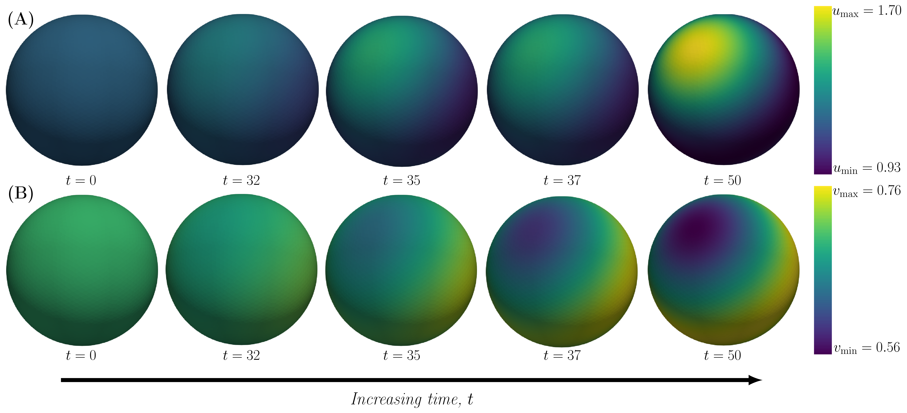
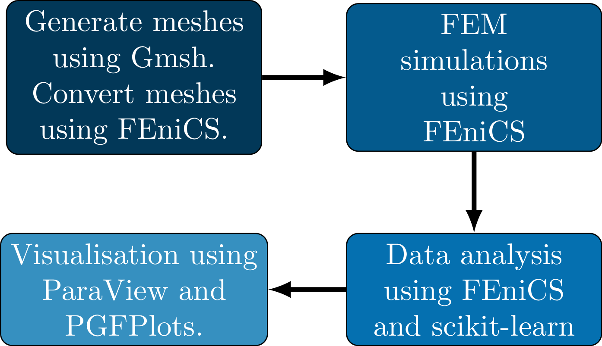

# The effect of a single hole in the unit sphere on Turing patterns
*Date:* 2021-09-18 
*Written by:* Johannes Borgqvist 

Description of the project

https://user-images.githubusercontent.com/77111216/190901847-791e2401-197a-4cc3-afd8-a9064b8fbf3a.mp4

## A note on reproducibility
For the purpose of reproducibility, the project is entirely written in Python and the installation of all required packages is managed by [anaconda](https://docs.anaconda.com/anaconda/install/index.html). Before presenting the instructions for installing all relevant packages using anaconda some information about the machine used to generate the results is presented. 

### Information about the laptop used to generate the results and write the code
The code has been developed and tested on a computer laptop with the following cpu information:

* Architecture:                    x86_64,
* CPU op-mode(s):                  32-bit, 64-bit,
* Byte Order:                      Little Endian,                                                                                                      
* Address sizes:                   39 bits physical, 48 bits virtual,                                                                                  
* CPU(s):                          8,
* On-line CPU(s) list:             0-7,
* Thread(s) per core:              2,
* Core(s) per socket:              4,
* Socket(s):                       1,
* NUMA node(s):                    1,
* Vendor ID:                       GenuineIntel,
* CPU family:                      6,
* Model:                           142,
* Model name:                      Intel(R) Core(TM) i7-10510U CPU @ 1.80GHz,
* Stepping:                        12,
* CPU MHz:                         800.057,
* CPU max MHz:                     4900,0000,
* CPU min MHz:                     400,0000,
* BogoMIPS:                        4599.93,
* Virtualisation:                  VT-x,
* L1d cache:                       128 KiB,
* L1i cache:                       128 KiB,
* L2 cache:                        1 MiB,
* L3 cache:                        8 MiB.

Some information about the *OS* of the machine is the following:

* Operating System: Ubuntu 21.04, 
* Kernel: Linux 5.11.0-31-generic,
* Architecture: x86-64.

### Installation of the packages using anaconda
	In order to make the project as reproducible as possible, the coding has been done entirely in Python and the installation of all necessary packages is made possible by the package [*conda*](https://anaconda.org/anaconda/conda) which is part of *anaconda*. The scripts associated with this project is enabled by four major platforms:
	
1. The [*FEniCS Project*](https://fenicsproject.org/) which is a "*popular open-source (LGPLv3) computing platform for solving partial differential equations (PDEs)*",
2. [*Gmsh*](https://gmsh.info/) which is a "*a three-dimensional finite element mesh generator with built-in pre- and post-processing facilities*",
3. [*scikit-learn*](https://scikit-learn.org/stable/) which is a library that enables "*machine Learning in Python*",
4. [*ParaView*](https://www.paraview.org/) which is an "*open-source, multi-platform data analysis and visualization application*".

Both of the first two and the last of these has a Python interfaces. Thus, all scripts which involve the scripts for generating the meshes using Gmsh, the scripts for conducting the FEM simulations using FEniCS and the scripts for analysing the data using scikit-learn are written in Python. For visualising the results, the graphical interface ParaView has been used as well as [*PGFPlots*](http://pgfplots.sourceforge.net/) in LaTeX. 

Provided that anaconda has been succesfully installed, the easiest way to install all relevant packages is to install two different conda environments. These can be accessed through the provided yml-files called *gmsh\_latest\_version.yml* and *fenicsproject.yml*. These two environments are installed using the command 

*conda env create -f gmsh\_latest\_version.yml* 

and 
*conda env create -f fenicsproject.yml* 

respectively. The first environment must be activated in order to generate the meshes using the relevant Python scripts via Gmsh. The second environment must be activated in order to run the FEM based simulations using FEniCS. 

When everything works properly, it should be possible to run all scripts inside these two conda environments. Both environments are activated and deactivated in the same way. For example, the environment  "*fenicsproject*" is activated using the command

* conda activate fenicsproject

and to exit this environment type

* conda deactivate
. As we said previously, the environment "*gmsh\_latest\_version.yml*" is activated and deactivated in the same way.

